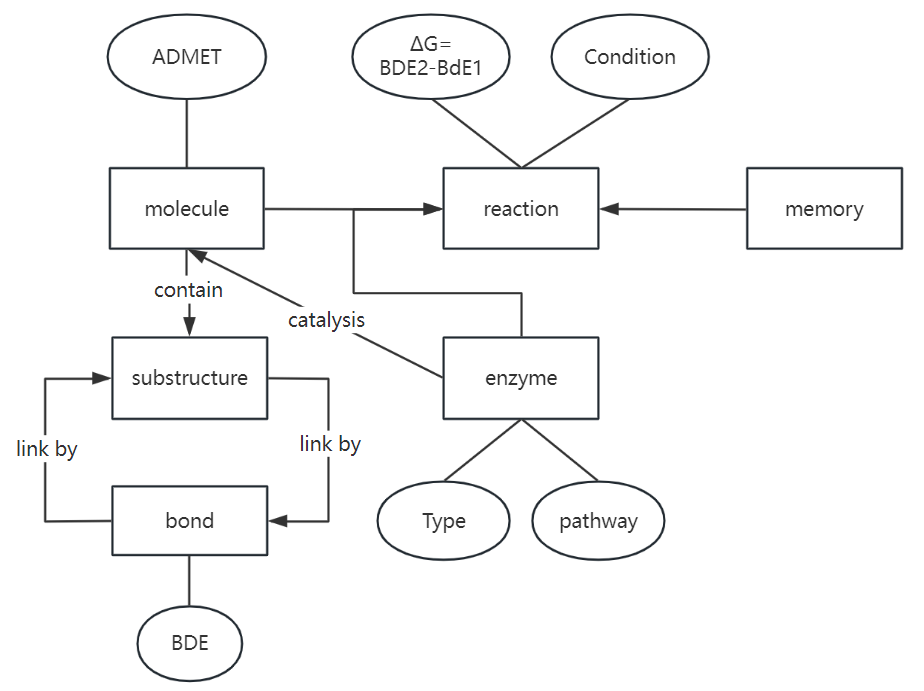

- 当前图模型以 `ReactionRecord` 为核心，把所有反应级证据先固定在“反应记录”这一层
- `Compound` 只保留分子属性，例如 `canonical_smiles`、`inchikey`、`morgan fingerprint`
- 扩展节点包括 `Enzyme`、`Pathway`、`Fragment`，分别用于酶证据、代谢上下文和子结构检索

| 类型 | 当前设计 | 作用 |
| --- | --- | --- |
| 节点 | `ReactionRecord` | 统一承载来源与反应级上下文 |
| 节点 | `Compound` | 跨来源共享的分子身份 |
| 节点 | `Enzyme` | 承载酶催化证据，服务酶推荐与可行性分析 |
| 节点 | `Pathway` | 承载代谢通路上下文，服务 pathway 预测 |
| 节点 | `Fragment` | 基于 RDKit `85` 个 `fr_*` 规则的片段层节点 |
| 关系 | `CONSUMES / PRODUCES` | 反应物与产物展开 |
| 关系 | `CATALYZED_BY` | 把反应记录连接到酶证据 |
| 关系 | `PARTICIPATES_IN_PATHWAY` | 把反应记录连接到代谢通路 |
| 关系 | `HAS_FRAGMENT` | 把分子连接到官能团/片段层，用于子结构检索 |

<!--  -->
