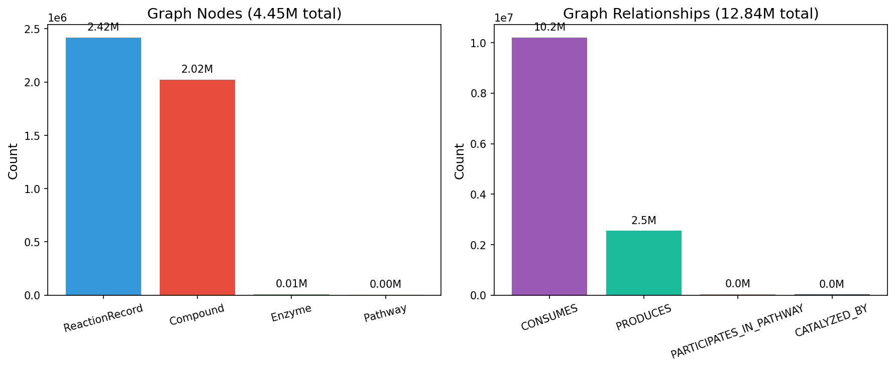

- 数据来源分两部分：`BKMS` 提供酶催化/代谢反应，`ORD` 提供大规模有机反应实验记录
- 当前全量导入结果：
  `BKMS 42,345` 条反应，`ORD 2,376,120` 条反应，合计 `2,418,465 ReactionRecord`
- 当前基础图规模为 `4.45M` 节点、`12.84M` 基础关系，已经达到真实可检索的百万/千万级别
- 在基础图之上，还额外挂上了 `85 Fragment` 节点和 `18.89M HAS_FRAGMENT` 边，作为子结构检索层

| 统计项 | 数值 |
| --- | --- |
| `ReactionRecord` | 2,418,465 |
| `Compound` | 2,022,086 |
| `Enzyme` | 7,826 |
| `Pathway` | 3,315 |
| `Fragment` | 85 |
| `HAS_FRAGMENT` | 18,892,205 |

<!--  -->
