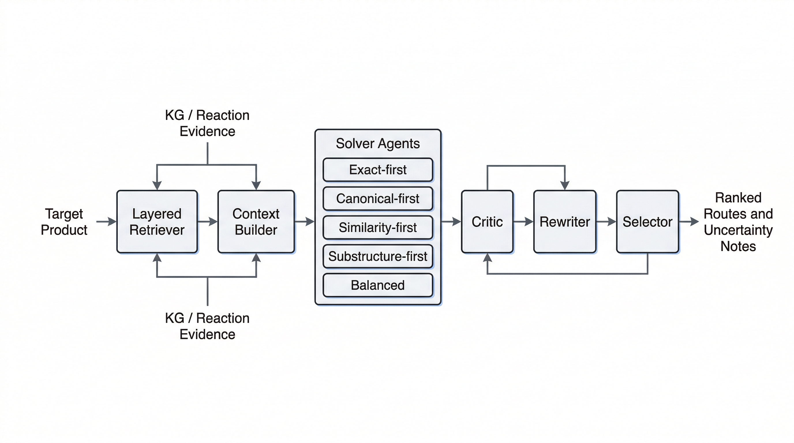

- 当前 `single-step` 原型已经把图检索层接进了完整流程
- 整体流程为：
  `LayeredRetriever -> ContextBuilder -> Solver Agents -> Critic -> Rewriter -> Selector`
- 其中 solver 目前有五种策略：
  `exact / canonical / similarity / substructure` / `balenced`
- selector 最终输出的不只是一个答案，还包括：
  `rankings`、`selection_reason`、`retrieval_summary`、`uncertainty_notes`

