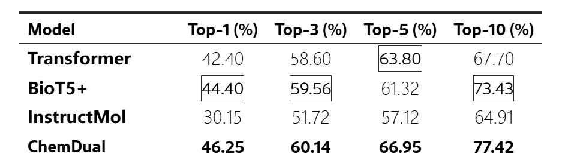

- 当前在GLM5上完成 `USPTO50k test` 的评测 top-k 结果为：
  
  `Top-1 = 0. 47`、`Top-3 = 0.51`、`Top-5 = 0.57`、`Top-10 = 0.59`
- 从样例输出看，当前很多候选仍主要依赖 `similarity` 层支持，模型推理能力不足
- 所以下一步重点把 retrieval 质量和 route ranking 做强，提升COT与Reasoning的能力

