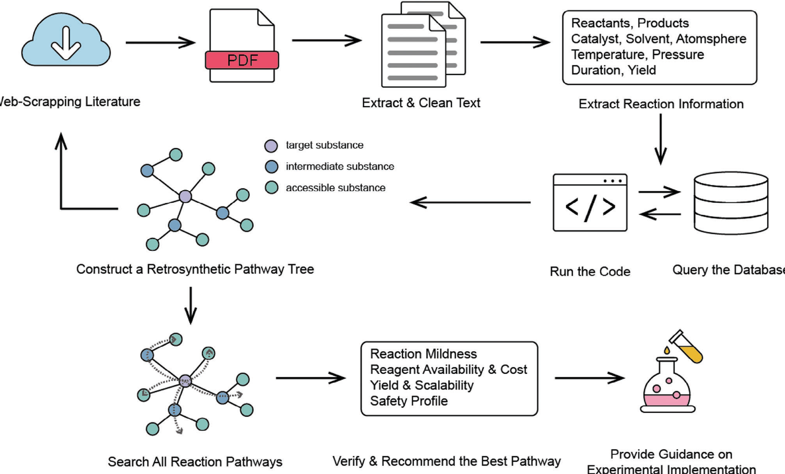

### 核心架构

- **自动化文献检索**: Google Scholar API + PDF 文本提取
- **知识图谱构建**: ChatGPT-4o API 提取反应信息并实体对齐
- **多分支反应路径搜索 (MBRPS)**: 识别所有有效合成路径

### 主要贡献

1. 知识图谱作为"外部脑"提供结构化化学约束
2. 记忆化深度优先搜索 (MDFS) 构建逆合成路径树
3. 基于反应条件、产率、安全性推荐最优路径