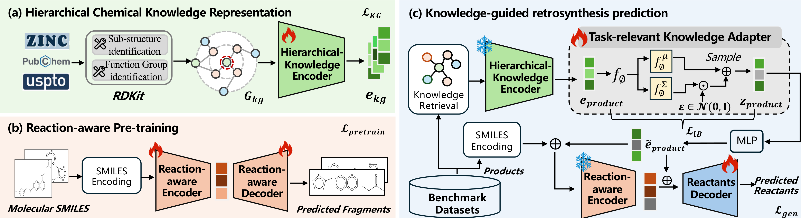

### KnowRetro 核心架构

- **层次化知识图构建**: BRICS 分解 + SMARTS 官能团识别 + RGCN 编码
- **反应感知预训练**: SMILES-to-substructure 翻译任务捕获反应模式
- **知识注入**: Task-relevant KG Adapter 过滤冗余信息，残差融合注入编码器

### 主要贡献

1. 知识图谱捕获分子-子结构-官能团的层次关系
2. 两阶段学习：化学引导预训练 + KG adapter 微调
3. USPTO-50K / USPTO-FULL 基准超越现有方法