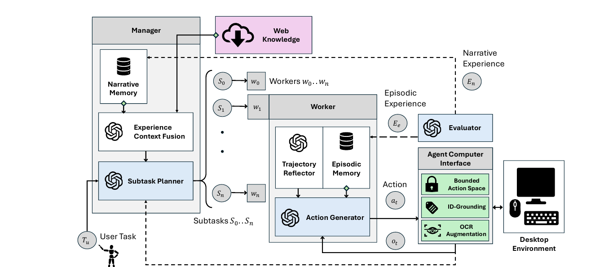
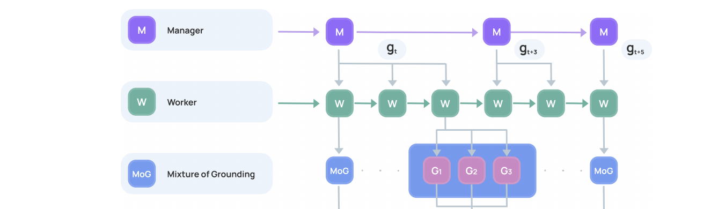
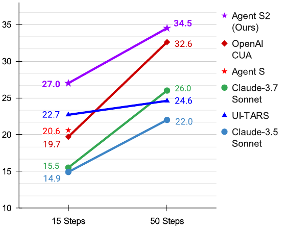
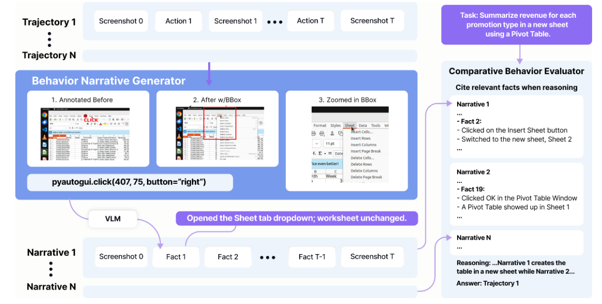
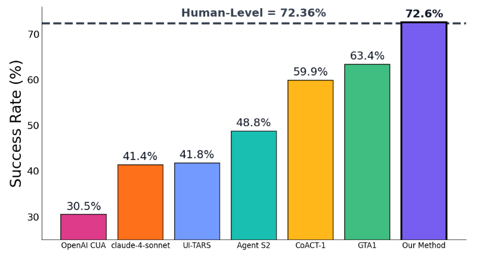

---
section_key: intro
section_title: 系列概览
subsection_title: 1、Agent-S 系列：三代演进
order: 1
---

**计算机操作智能体（Computer-Use Agent）** 的目标是通过直接操作 GUI，像人一样完成数字任务。Agent-S 系列用三篇论文，讲了一个从「开放式智能体框架」到「超越人类」的完整故事。

| 论文 | 会议 | 核心主张 |
| --- | --- | --- |
| **Agent S**（arXiv:2410.08164） | ICLR 2025 | 经验增强层次规划 + 自监督记忆 + Agent-Computer Interface |
| **Agent S2**（arXiv:2504.00906） | COLM 2025 | 组合式「泛化-专家」框架 + Mixture of Grounding + 主动层次规划 |
| **Agent S3**（arXiv:2510.02250） | TMLR 2026 | Behavior Judge：大规模轨迹缩放，首次在 OSWorld 超越人类水平（72.6%） |

> **演进主线**：从「让智能体更像人思考」→「让不同专长的模型各司其职」→「用规模化与有效评估把正确轨迹找出来」。

---
section_key: s1
section_title: Agent S：开放式框架
subsection_title: 2、S1 背景：计算机操作的三大瓶颈
order: 2
---

**Agent S** 要解决的核心问题：如何让智能体真正像人一样操作真实桌面环境。作者指出传统方法面临三个挑战：

| 挑战 | 具体表现 |
| --- | --- |
| **领域知识** | 应用和网页不断变化，需要及时、动态的领域知识 |
| **长程任务** | 任务由相互依赖的多个子目标组成，需要明确规划 |
| **动态非一致界面** | 海量视觉/文本信息 + 大动作空间，需要精准理解图表、处理反馈 |

> 现有 GUI 智能体普遍只在**单个窗口**、用**预定义 API 或动作空间**操作，无法覆盖真实桌面任务的开放性。

---
section_key: s1
section_title: Agent S：开放式框架
subsection_title: 3、S1 系统框架：经验增强层次规划
order: 3
---

**Agent S** 把复杂的操作系统控制任务，拆解为三个可自省的模块，形成一个闭环。

| 模块 | 作用 |
| --- | --- |
| **Manager** | 经验增强的层次规划：从外部 Web Knowledge 与内部 Narrative Memory 中检索，生成子目标序列 |
| **Worker** | 从 Episodic Memory 汲取经验，逐步执行子目标并产生动作（含 Trajectory Reflector 自省） |
| **Agent-Computer Interface** | 感知与落地：Bounded Action Space + ID-Grounding + OCR，弥合 MLLM 与现代 GUI 的鸿沟 |

> 循环通过 **Self-Evaluator** 评估轨迹，将奖励以文本形式写回记忆，形成类似经典强化学习的「经验-奖励」闭环。

---
section_key: s1
section_title: Agent S：开放式框架
subsection_title: 4、S1 实验结果：OSWorld 上提升 9.37%
order: 4
---

Agent S 在 OSWorld 基准（369 个真实计算机任务）上取得显著提升，跨 OS 泛化能力强。

| 指标 | 结果 |
| --- | --- |
| **OSWorld 成功率** | **20.58%**（overall），比最佳 baseline（GPT-4o 的 11.21%）提升 9.37% |
| **强项类别** | Daily（27.06%）与 Professional（36.73%），显著超出 baseline |
| **泛化性** | WindowsAgentArena 上提升到 13.8%（无针对性适配） |
| **消融关键** | 移除 Web Knowledge / Narrative Memory 分别掉到 16.80% / 13.68%，证明「从经验学习」至关重要 |

> **洞察**：经验增强 + 层次建模是立竿见影的；但 Agent S 依赖单一基础模型（GPT-4o / Claude-3.5-Sonnet），推理算力与领域专长受限。

---
section_key: s2
section_title: Agent S2：组合式框架
subsection_title: 5、S2 动机：为什么单一模型不够
order: 5
---

**Agent S2** 指出当前智能体的另一组瓶颈，来自「依赖单一生成模型」：

| 现状 | 问题 |
| --- | --- |
| **粗粒度落地（grounding）** | 难以从文本描述准确落到像素级 UI 元素 |
| **长程任务** | 易受后台干扰、弹窗、用户上下文变化影响 |
| **单一模型兼顾一切** | 泛化模型在特定子任务上往往**不如专家模型**，拖累整体性能 |

> **解决思路**：组合式（compositional）框架——把「推理/规划」与「落地/接地」职责，委派给不同的泛化模型与专家模型。

---
section_key: s2
section_title: Agent S2：组合式框架
subsection_title: 6、S2 框架：泛化-专家分工 + Mixture of Grounding
order: 6
---

Agent S2 用**泛化主义（generalist）与专家（specialist）模型组合**，替代单一模型，并引入关键新机制。

| 模块 | 职责 |
| --- | --- |
| **Manager M** | 高层规划：把任务拆成高层子目标 |
| **Worker W** | 低层执行：生成自然语言动作子目标 |
| **Mixture of Grounding (MoG)** | 精准落地：用专家模型把动作路由到最合适的落地专家，解决 UI 定位瓶颈 |
| **Proactive Hierarchical Planning** | 主动再规划：在子目标完成后动态调整、重新规划（而非被动反应） |

> **落地专家**：像素坐标、OCR 文本、表格单元，如 spreadsheet 的 cell。

---
section_key: s2
section_title: Agent S2：组合式框架
subsection_title: 7、S2 实验：OSWorld SOTA 与大幅提升
order: 7
---

| 基准 | 成绩 | 相对提升 |
| --- | --- | --- |
| **OSWorld（15-step）** | 27.0% → **34.5%** | +18.9%（vs Claude-3.7-Sonnet） |
| **OSWorld（50-step）** | 24.5% → **34.5%** | +32.7%（vs UTC 最佳） |
| **WindowsAgentArena** | — | +52.8% |
| **AndroidWorld** | — | +54.3% |

> **消融结论**：移除 MoG 或 Proactive Hierarchical Planning，成功率明显下降；**模型组合能带来超过单一最优模型的性能**。

---
section_key: s3
section_title: Agent S3：长程任务框架
subsection_title: 8、S3 挑战：长程任务的不稳定性与评估瓶颈
order: 8
---

Agent S3 关注计算机操作智能体的**可靠性**：长程、复杂任务下，单次执行极不稳定。作者的核心诉求是**规模化（scaling）**。

| 问题 | 说明 |
| --- | --- |
| **单次执行脆弱** | 少量错误随时间累积，导致结果方差大、不可靠 |
| **单轨迹缩放收益有限** | 此前「step-wise scaling」对长程任务总体提升有限 |
| **宽缩放（wide scaling）暴露评估瓶颈** | 生成多条轨迹后，如何**自动、可靠地评估并选出正确**的一条，是硬骨头 |

> **宽缩放**：不是增加单次执行长度，而是**并行生成多条轨迹**，再用一个可靠的判据从中挑选最优——难点在于「轨迹评估」。

---
section_key: s3
section_title: Agent S3：长程任务框架
subsection_title: 9、S3 核心：Behavior Judge 把轨迹变成叙事
order: 9
---

**Behavior Judge** 解决「评估瓶颈」：先把冗长、噪声高的轨迹，压缩成可比较的「行为叙事」，再在叙事层面做选择。

| 组件 | 作用 |
| --- | --- |
| **Behavior Narrative Generator** | 用 VLM 把每条轨迹转成叙事（动作 → 效果，过滤无关细节） |
| **Comparative Behavior Evaluator** | 用 VLM 对多条叙事做比较评估，选出最优轨迹 |
| **植入的 Agent Framework** | Agent S3 用更高性价比的 coding agent + flat policy，直接合成高质量轨迹 |

---
section_key: s3
section_title: Agent S3：长程任务框架
subsection_title: 10、S3 主结果：首次在 OSWorld 超越人类水平
order: 10
---

**Agent S3 + Behavior Judge 在 OSWorld（100-step）上达到 72.6%，首次超越人类水平（~72.36%）。**

<!-- | 方法 | 成功率 |
| --- | --- |
| OpenAI CUA | 30.5% |
| Claude-4-sonnet | 41.4% |
| UI-TARS | 41.8% |
| Agent S3（100-step） | 62.6% |
| **Agent S3 + BJudge（Ours）** | **72.6%** | -->

> **泛化性**：WindowsAgentArena 由 50.2% 提升至 **56.6%**；AndroidWorld 由 68.1% 提升至 **71.6%**（zero-shot 迁移）。

---
section_key: summary
section_title: 总结
subsection_title: 12、总结
order: 12
---

回顾三代，Agent-S 系列是在回答同一个问题：**怎样让智能体真正可靠地操作计算机？**

| 阶段 | 关键动作 | 启示 |
| --- | --- | --- |
| **S1** | 把「人怎么思考」结构化：层次规划 + 经验 + ACI | 经验与自省让单模型更强 |
| **S2** | 把「分工」做到极致：泛化-专家组合 + MoG | 善用不同专长的模型，组合 > 单一 |
| **S3** | 把「规模化」做对：多轨迹 + 叙事级评估 | 单次执行有极限，**选对轨迹**才能质变 |

> **我们的思路**：操作预录制作为skill，可靠得重放这些skill来进行自动化、规模化的操作。

> **对我们的经验**：面对长程、开放的 Agent 任务，不仅要锁定能不能生成的问题，更要看如何可靠地评估与选择。

> **提升思路**： 结合我们的预录制的SpeedAI方案，让Agent自探索软件、OS、Web、Android的特征特性，熟悉各个UI工具操作，进行Agentic自探索总结经验，然后再结合多轨迹 + 叙事级评估来提升效果和性能。