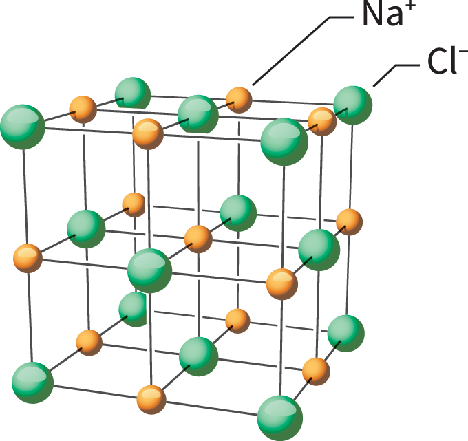

任务定位：给定目标分子，自动生成可执行的逆合成路径，并优先选择热力学更合理的断键步骤。

- 为什么关键：逆合成是化学合成设计的核心场景，直接决定路线长度、成本与可实现性。
- BDE价值：将“断哪根键”转化为可量化的能量排序问题，减少低可行性候选。
- 任务输入：目标分子、反应模板库、可用试剂与条件约束。
- 任务输出：候选路径、每步断键解释、置信度与替代路线。
- 典型指标：Top-k断键命中率、路径成功率、平均步骤数、计算成本。

