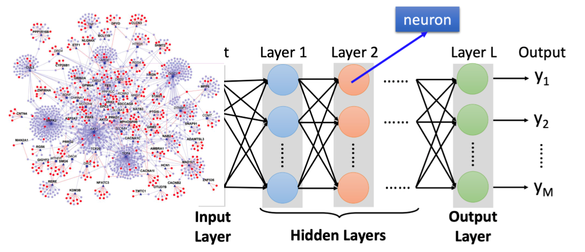

总体路线分三层：

1. **任务层**：输入具体任务目标与约束（如逆合成路径长度、反应可行性、候选筛选成本）。
2. **核心层**：Energy Core Agent 提供统一能量判别能力（BDE/BDFE 语义与不确定性估计）。
3. **执行层**：各领域 Agent 负责任务特定推理与工具调用，返回可评估输出。

关键思想：

- 用统一能量语义替代“任务各自为政”的特征体系。
- 用 Orchestrator 把“目标拆解、调用顺序、反馈回路”工程化。
- 用 Evaluator 与共享记忆形成持续改进闭环。

<!--  -->
