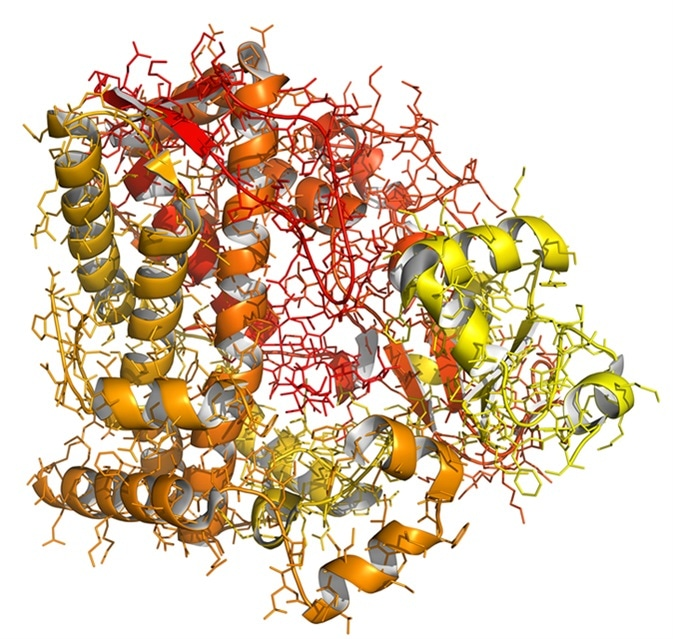
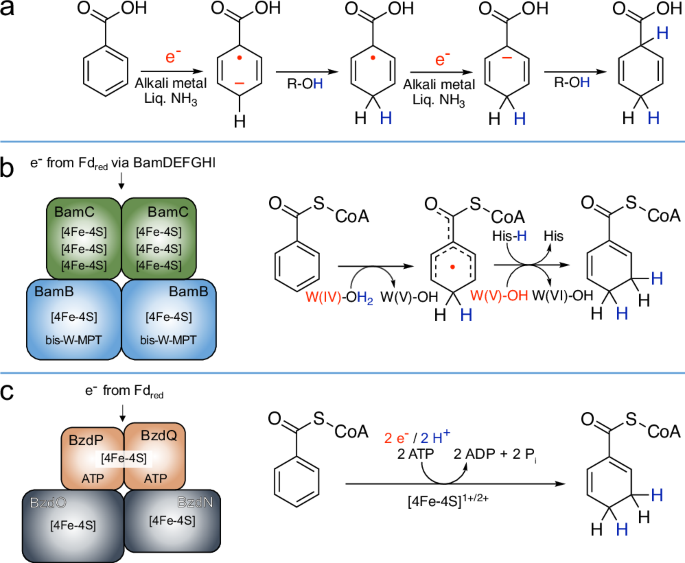

三类任务均复用同一 Energy Core Agent，仅替换任务适配器。

| 任务 | 输入 | 指标 | 目标 |
| --- | --- | --- | --- |
| 代谢位点预测 | 分子结构 + 酶环境约束 | 位点命中率、Top-k准确率 | 验证能量脆弱位点识别能力 |
| 蛋白/酶反应性 | 残基环境 + 反应条件 | 位点排序相关性、解释一致性 | 验证自由基反应性推断能力 |
| 结合自由能排序 | 蛋白-配体候选集合 | 排序相关性、误差统计 | 验证跨任务热力学一致性 |

