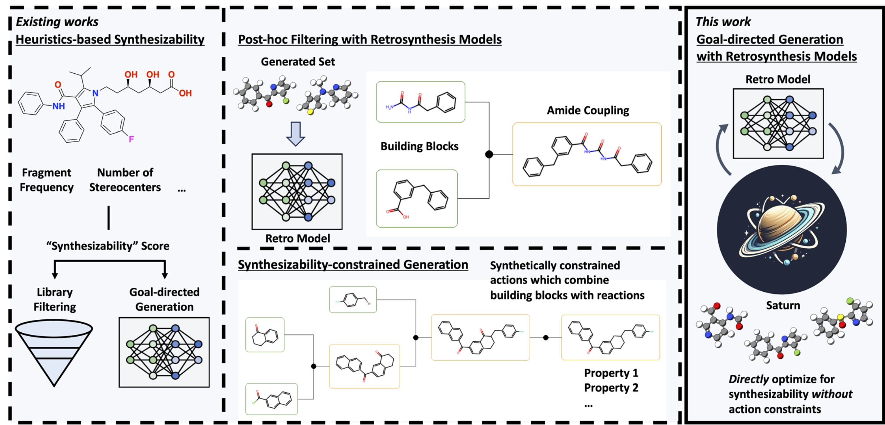

- 分子生成模型已经能优化活性、性质和多目标指标，但真正落地前必须先回答一个问题：这些分子能不能合成
- 现有常见做法有三类：用 SA score 等启发式指标、生成后再做 retrosynthesis 过滤、或直接把生成空间限制在反应模板内
- 本文真正要解决的不是“再造一个逆合成模型”，而是回答能否把 retrosynthesis 直接作为生成优化里的 oracle
- 作者的判断是：只要生成模型足够 sample-efficient，这件事是可行的

