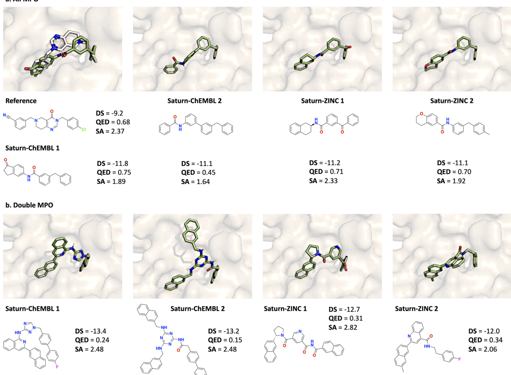

- 这一页不是在证明 docking 更准，而是在说明模型没有只学到表面分数，而是真的找到了一批结构上可解释的候选
- 图中展示的是不同 Saturn 配置下 docking score 最优的分子及其 pose
- 这些分子不仅分数好，而且都能被 AiZynth 求解，这让“性质优化”和“可合成性约束”第一次在同一个闭环里统一起来
- 同时也能看出，只优化 docking 和 solvability 的版本更容易走向更激进的结构

