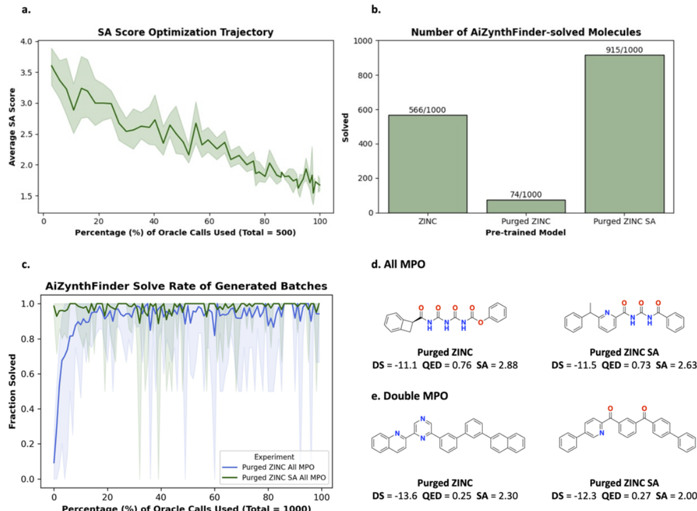

- 作者故意构造了一个更难的起点：把预训练数据里能被 AiZynth 求解的分子全部剔除，再重新训练生成模型
- 按直觉，这样的模型应当更容易生成不可合成分子，但作者用一个简单的 curriculum learning 把它拉了回来
- 做法是先让模型学会优化 SA score，再切换到带 retrosynthesis 的目标，结果很快恢复到高 solvability 区域
- 这说明直接优化这条路线并不只依赖“幸运的训练分布”，而是有一定鲁棒性

