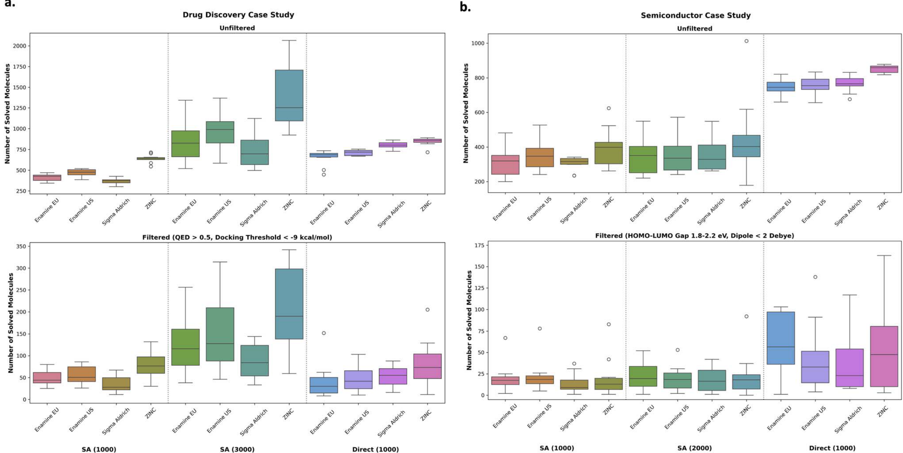

- 这是全文最有价值的结论：是否值得把 retrosynthesis 放进闭环，不是统一答案，而是取决于任务分布
- 在 drug-like 分子任务里，SA score 这类启发式和 solvability 仍然有较强相关性，因此“先优化 SA 再后过滤”更省资源
- 但换到功能材料任务，这种相关性显著减弱，直接优化 retrosynthesis 才真正带来优势
- 所以本文给出的不是一个普遍替代方案，而是一条新的资源分配策略

