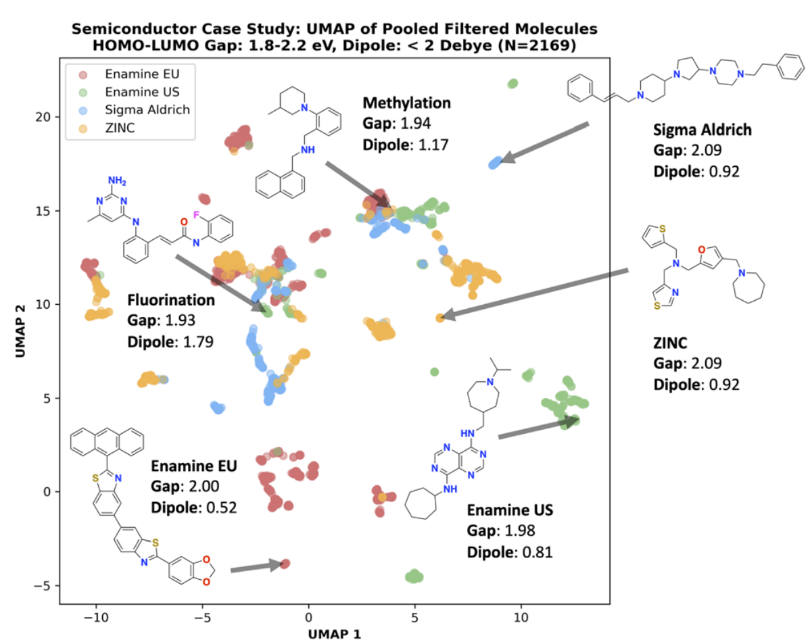

- 在功能材料任务中，不同 building block stock 会定义不同的“可合成空间”，这也是论文把 stock 当成重要变量的原因
- 图中的 UMAP 说明，生成结果会随着 stock 的不同进入不同化学区域
- 这进一步支持作者的判断：当分子空间偏离 PubChem 这类经典药物分布时，SA score 这类启发式会快速失灵
- 因而在 OOD 化学空间里，retrosynthesis 不只是更贵的 proxy，而是更接近真实目标的信号

