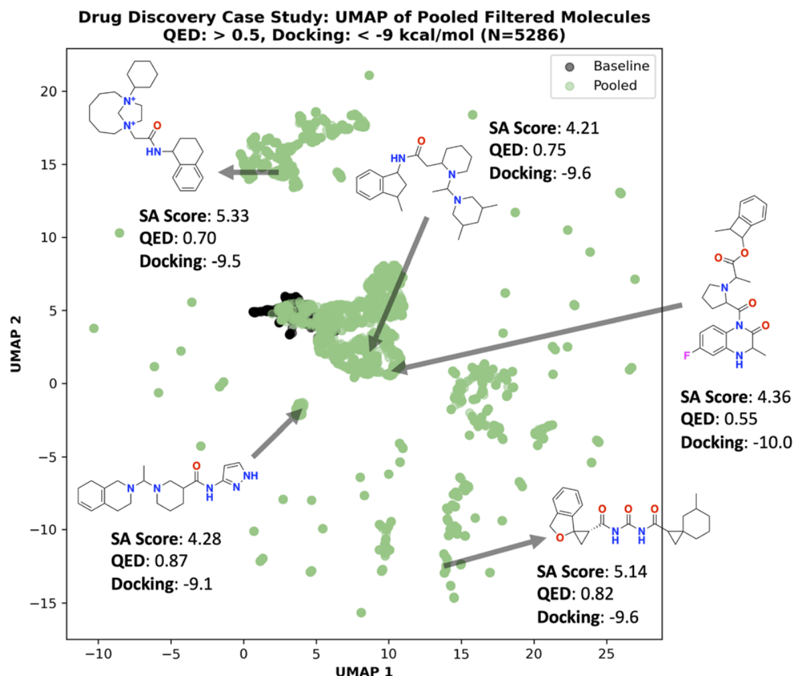

- 最核心结论：只要生成模型足够 sample-efficient，直接把 retrosynthesis 当作优化 oracle 是可行的
- 但更重要的结论是：这条路线并不总优于启发式，而是在 OOD 化学空间中更有价值
- 对 drug-like 任务，heuristic + post hoc filtering 仍然是高性价比方案；对功能材料任务，直接优化 retrosynthesis 更可靠
- 我认为这篇文章最大的贡献不是又做出一个更强模型，而是更清楚地划分了 heuristic 与真实 solvability 的适用边界

