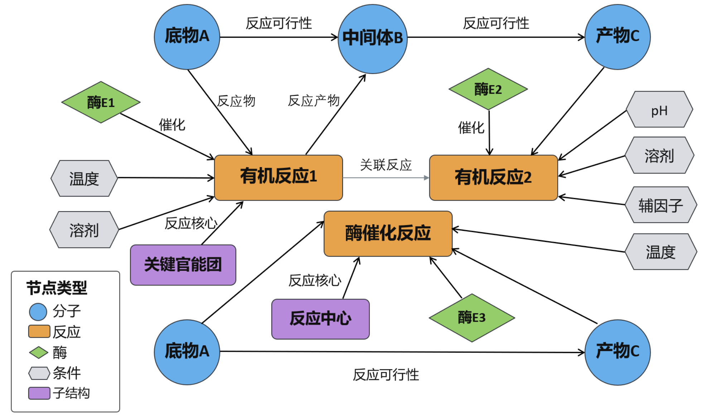

- 当前 single-step 的核心问题已经从”有没有候选”转向”候选能不能排对”
- 误差主要来自`similarity` 层的弱证据容易混入上下文，critic 和 selector 对不合理路线的不会剔除

| 优化维度 | 具体目标 |
| --- | --- |
| Retrieval | 提高高质量 candidate 的进入率 |
| Agent Reasoning | 提高 route critique 与重排质量 |
| Chemistry Prior | 显式引入 BDE 稳定性约束 |

