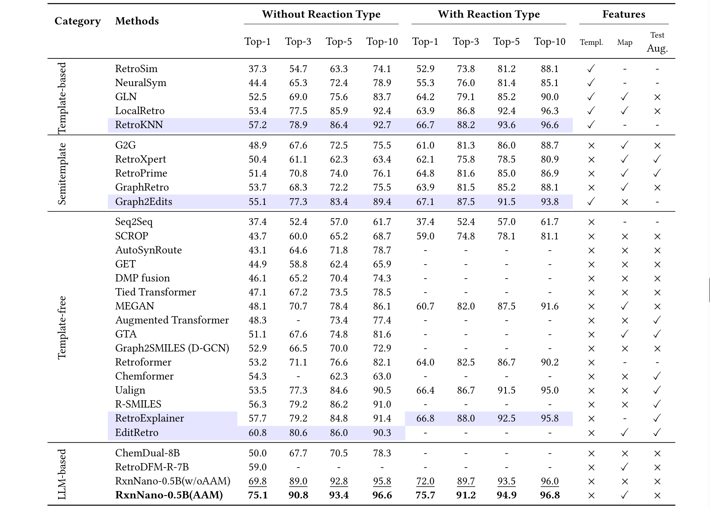

---
section_key: progress
section_title: 进展
subsection_title: 本次汇报重点
order: 1
---
- 本周工作集中在 single-step retrosynthesis 系统优化与酶催化预测

- 核心工作：
  - 优化单步反应预测流程：分层 RAG candidate aggregation 与排序权重调整
  - Multi-agent 的 prompt、critic（BDE） 和 selector 逻辑重写
  - 酶推荐实验：预测反应的最可能催化酶类别（EC number）
  - 酶反应识别实验：判断给定反应是否为酶催化反应

---
section_key: progress
section_title: 进展
subsection_title: 当前问题与优化目标
order: 2
---
- 当前 single-step 的核心问题已经从”有没有候选”转向”候选能不能排对”
- 误差主要来自`similarity` 层的弱证据容易混入上下文，critic 和 selector 对不合理路线的不会剔除

| 优化维度 | 具体目标 |
| --- | --- |
| Retrieval | 提高高质量 candidate 的进入率 |
| Agent Reasoning | 提高 route critique 与重排质量 |
| Chemistry Prior | 显式引入 BDE 稳定性约束 |

---
section_key: method
section_title: 方法
subsection_title: 当前 Single-Step Multi-Agent Pipeline
order: 3
---
<!-- - 单步逆合成流程已定型：
  `LayeredRetriever → ContextBuilder → Solver Agents → Critic → Rewriter → Selector`
- 先检索，再提方案、做批判，最后统一排序
- 除 `best_route` 外，还会保留：

### 各阶段职责 -->

| 阶段 | 输入 | 输出 | 作用 |
| --- | --- | --- | --- |
| Retriever | target SMILES | layered retrieval hits | 检索分层证据 |
| ContextBuilder | retrieval hits | evidence pack | 整理 candidate 与支持强度 |
| Solver Committee | evidence pack | 5 条初始 routes | 从不同偏好各提一个方案 |
| Critic | routes + evidence | critique report | 检查证据与路线合理性 |
| Rewriter | routes + critiques | rewritten routes | 去重、补充、重排 |
| Selector | rewritten routes | best route + rankings | 给出最终排序 |

---
section_key: method
section_title: 方法
subsection_title: 分层 RAG 与 Candidate Aggregation 优化
order: 4
---
| 层级 | 作用 | 调整 |
| --- | --- | --- |
| exact | 精度最高 | 提高排序权重 |
| canonical | 对齐表示差异 | 作为高可信补充 |
| similarity | 解决召回不足 | 压制噪声，防止 flooding |
| substructure | fallback 证据 | 保留，同时也压制噪声 |

### 聚合策略

- 权重：`exact 1.5 > canonical 0.7 > similarity 0.35 > substructure 0.2`
- 提高 `multi-level / multi-source bonus`
- 加入 precursor size penalty

### Candidate 分数计算

- `weighted_score = Σ(level_weight × hit_score)`
- `aggregate_score = weighted_score + multi_level_bonus + 0.04 × source_count - size_penalty`

---
section_key: method
section_title: 方法
subsection_title: Multi-Agent设计 与 BDE 嵌入方式
order: 6
---
### Multi-Agent 设计
- Solver agent 采用 committee 结构，五个 agent 分工明确
- 五个 solver 并行处理同一个 evidence pack：
  `exact / canonical / similarity / substructure / balanced`
- Prompt 设计聚焦两点：
  - 只能在已有 candidate 中选择
  - 输出必须为 strict JSON

### BDE 嵌入方式

- 对每条 solver route 执行 `_bde_critique()`
- 输出 `route_id → issues` 映射
- 写入 critic 输入的 `routes["bde_analysis"]` 字段
<!-- - BDE 不是写在 prompt 文案中，而是作为结构化信息与 route 一起送入 -->

<!-- | 阶段 | 输入 | 作用 |
| --- | --- | --- |
| Solver | `evidence_pack + bias_level` | 从候选中选定 route |
| Critic | `evidence_pack + routes + bde_analysis` | 批判 route 并改分 |
| Rewriter | `evidence_pack + initial_routes + critique_report` | 整理最终候选池 | -->

---
section_key: method
section_title: 方法
subsection_title: BDE 加入 Critic 的具体设计
order: 7
---
- 将 `BDE stability check` 接入 critic 流程
- 原因：retriever 负责尽量找全候选，critic 负责根据化学合理性压降不稳定路线

### BDE 检查流程

1. 计算 target 的 weakest bond BDE
2. 计算所有 precursor 中最低的 weakest bond BDE
3. 低于 `60 kcal/mol`：标记为高反应性风险
4. 比 target 低超过 `20 kcal/mol`：标记为不利能量差
5. 将上述 issue 转为 critic penalty

### Critic 扣分规则

- 无 `exact / canonical` 支持：`-0.18`
- 仅一条 supporting reaction：`-0.05`
- 无 source provenance：`-0.05`
- 每条 BDE issue：`-0.15`

<!-- | 设计位置 | 原因 |
| --- | --- |
| 不放在 retriever | 避免过早牺牲召回 |
| 放在 critic | 适合做 chemistry-aware re-ranking |
| 不使用 hard filter | 对边界样本更稳健 | -->

---
section_key: experiment
section_title: 实验
subsection_title: 单步逆合成实验
order: 8
---
| Model                 | Top1 | Top3 | Top5 | Top10 |
|----------------------|-----:|-----:|-----:|------:|
| ChemDual-8B          | 50.0 | 67.7 | 70.5 |  78.3 |
| RetroDFM-R-7B        | 59.0 |  -   |  -   |   -   |
| Transformer          | 42.40     | 58.60     | 63.80     | 67.70      |
| BioT5+               | 44.40     | 59.56     | 61.32     | 73.43      |
| InstructMol          | 30.15     | 51.72     | 57.12     | 64.91      |
| **RxnNano-0.5B(AAM)**| **75.1** | **90.8** | **93.4** | **96.6** |
| EnergyKG| 52.1 | 56.2 | 58.7 | 62.6 |

---
section_key: experiment
section_title: 实验
subsection_title: 酶反应识别实验
order: 9
---
### 任务定义

- 给定一个 reaction step，判断是否为酶催化反应，为二分类问题

### 数据与基线

- 正样本：ECReact
- 负样本：USPTO-1000-TPL
- 基线：基于 RetroBioCat 135 个酶反应模板的模板匹配方法，ChemEnzyRetroPlanner

### 结果对比

| 方法 | Accuracy | Precision | Recall | F1 | MCC | AUC | 推理时间 (s/sample) |
| --- | --- | --- | --- | --- | --- | --- | --- |
| ChemEnzyRetroPlanner | 0.9984 | 0.9960 | 0.9895 | 0.9927 | 0.9918 | 0.9999 | 0.0014 |
| 模板匹配 | 0.6179 | 0.0613 | 0.1725 | 0.0904 | -0.1046 | - | 0.0064 |
| EnergyKG | 0.9986 | 0.9958 | 0.9900 | 0.9928 | 0.9920 | 0.9998 | 2.8300 |

---
section_key: experiment
section_title: 实验
subsection_title: 酶推荐实验
order: 10
---
- 给定酶反应，预测最可能催化它的酶类别（推荐 EC number）
- 多分类问题，评估两个粒度：（1）EC-L3：前三层 EC，（2）EC-L4：完整四层 EC

<!-- ### 基线方法

- **CLAIRE**：原版仅支持 EC-L3，改造为支持 EC-L4 后重新训练
- **Selenzyme 2023** -->

<!-- ### EC-L4 结果（完整四层） -->

| 方法 | Top-1 | Top-3 | Top-5 | F1 |
| --- | --- | --- | --- | --- | --- |
| CLAIRE | 52.96% | 64.48% | - | - |
| Selenzyme 2023 | 26.49% | 27.14% | 27.36% | -  |
| ChemEnzyRetroPlanner | 65.31% | 73.39% | 76.75% | 0.6270  |
| EnergyKG | 72.50% | 77.80% | 80.60% | 0.6770 |

| 方法 | Top-1 | Top-3 | Top-5 | F1 |
| --- | --- | --- | --- | --- |
| CLAIRE | 82.57% | 91.95% | - | - |
| Selenzyme 2023 | 72.43% | 74.16% | 74.52% | - |
| ChemEnzyRetroPlanner | 83.55% | 88.81% | 91.01% | 0.8247 |
| EnergyKG | 89.50% | 93.70% | 96.10% | 0.8747 |
