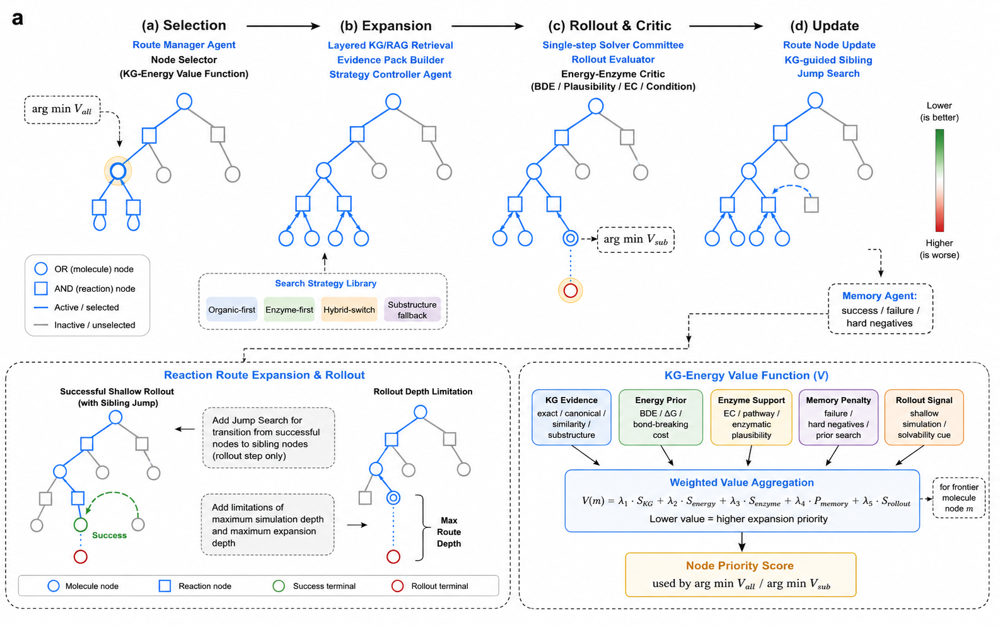

<!-- **四阶段主循环**

```text
(a) Selection → (b) Expansion → (c) Rollout & Critic → (d) Update
``` -->

- **圆形节点**：分子节点（OR）—— 选择一种反应即可
- **方形节点**：反应节点（AND）—— 所有前体都必须解决
- **蓝色路径**：当前激活的搜索路径
- **Lower is better**：价值分数越低，路线越有前景

