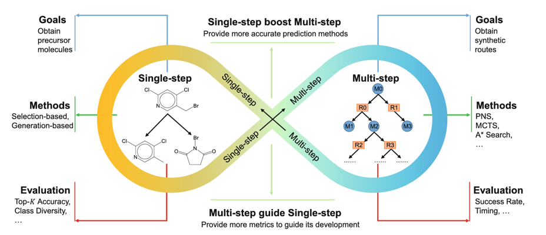

**单步逆合成**：给定目标产物分子 $M$，寻找一组可行的前体分子 $\{P_1, P_2, \ldots\}$ 及其对应的化学反应 $r$，使得 $\{P_i\} \xrightarrow{r} M$。现有方法主要分为三类：

- **模板驱动方法**：依赖专家手工或自动提取的反应模板进行断键匹配，可解释性强但覆盖度有限
- **无模板方法**：将逆合成视为序列到序列或图到图的生成任务，覆盖广但缺乏化学约束
- **半模板方法**：先预测反应中心再检索或匹配模板，兼顾灵活性与合理性

**多步逆合成**：递归应用单步预测，构建从目标分子到可购买试剂的合成树。搜索策略除经典的A*（如 Retro*）外，还包括蒙特卡洛树搜索（MCTS）、基于语言模型的序列规划等方法。核心挑战是搜索空间随深度指数膨胀。

**共同的物理约束**：无论单步还是多步，无论采用何种搜索策略，一条合理的逆合成路径必须满足热力学一致性——每一步断键/成键反应在能量上可行，且全局路径的总能量代价处于合理范围内。现有方法大多忽视这一约束。
