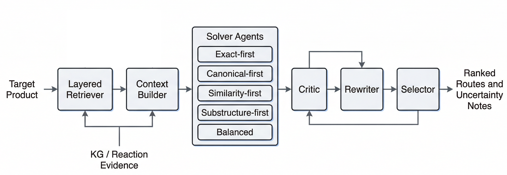

**单步逆合成采用六阶段 Energy Core Agent 流水线：**

```text
Retriever → ContextBuilder → Solver Committee → Critic → Rewriter → Selector
```



先检索证据，再生成候选方案、进行批判性评估，最后统一排序输出。除 `best_route` 外，还会保留完整 ranking 用于下游分析。
